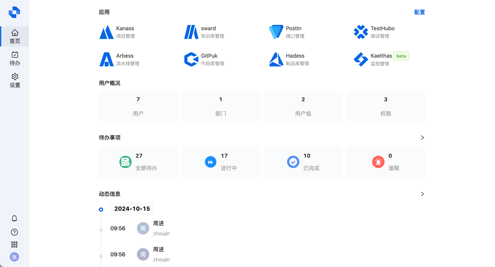
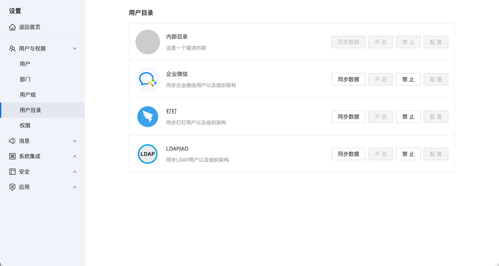
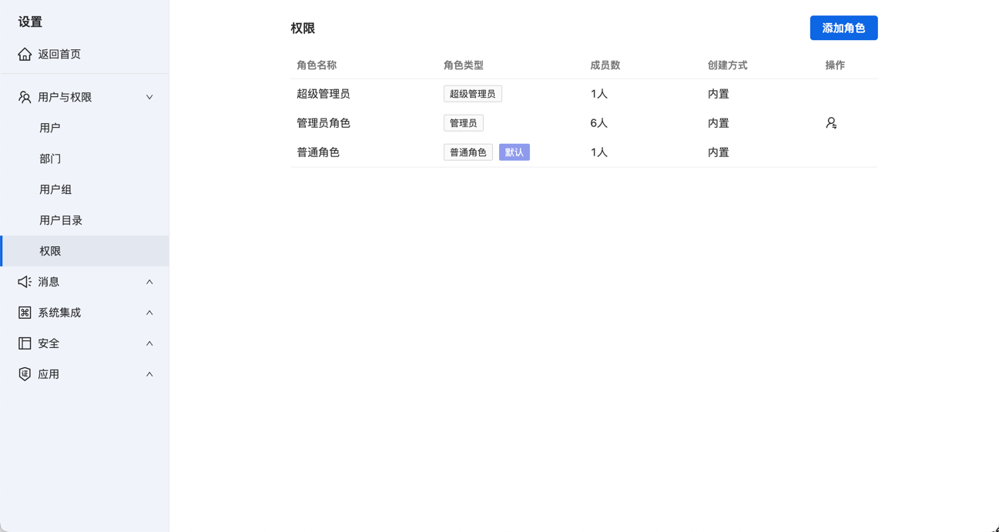

<h1 align="center" style="border-bottom: none">
    <a href="https://soular.tiklab.net/" target="_blank"></a><br>soular
</h1>

# soular - 账号与门户中心管理工具

soular是一款开源、免费的账号中心管理工具，帮助你轻松实现用户管理、权限控制、消息动态管理和统一认证等功能，全面提升系统的安全性和管理效率。
## 主要功能

### 1. 产品集成
- 不同系统的消息，代办，动态在这里都能获取到。。
- 关联所有Tiklab应用。
- 集成TikLab下产品，同一用户访问多个应用。



### 2. 账号管理
- 多种账号体系，包括内部用户，企业微信用户，Ldap用户。
- 在目录服务中管理不同的组织单位。
- 根据不同的角色和职责创建用户组。
- 根据公司的战略目标和业务需求，设置不同的部门。




### 3. 权限控制
- 对资源的具体操作进行权限划分。
- 授权用户能访问特定应用功能和数据。
- 根据业务需求，自定义角色及其权限。



### 4. 消息管理
- 支持多种消息方式，满足你多种需求。
- 是否发送，发送渠道，发送人员，完全自定义。


## 产品优势
- **安全可靠**：内置多层安全机制，确保用户数据的隐私和系统的安全性。
- **开源免费**：免费开源，适合各类企业和个人开发者。
- **易于集成**：支持与主流开发工具和平台的无缝集成，降低适应成本。
- **可扩展性强**：灵活的插件机制，便于根据需求扩展功能。

## 安装

### 系统要求
- Java 16+
- Maven 3.4+

### 克隆仓库
```bash
git clone https://github.com/tiklab/tiklab-soular.git
cd tiklab-soular
```

### 构建项目
- **MAC系统**：mvn clean package -P system-mac,env-dev
- **Linux系统**：mvn clean package -P system-linux,env-dev
- **Windows系统**：mvn clean package -P system-windows,env-dev

### 使用示例
1. 使用IDEA运行SoularApplication启动。
2. 打开浏览器，访问 http://localhost:8080
3. 登录信息，用户名：admin 密码：123456


### 贡献
我们欢迎社区的贡献！如果你有好的建议或发现了问题，请通过以下方式联系我：

[联系我们](https://tiklab.net/account/workOrder/add)

邮箱: tiklab@163.com

如需了解更多信息，请访问我们的官方网站或加入我们的社区讨论：

[官方网站](https://www.tiklab.net)

邮箱: tiklab@163.com

#### 快来体验Soular，让你的账号管理更轻松高效！

